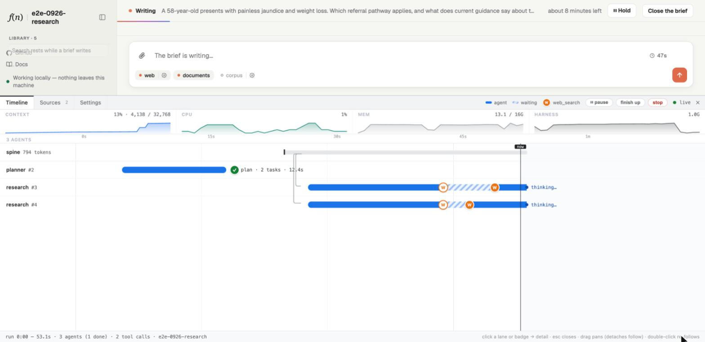

# Harness Development Kit

[](https://github.com/lloyal-ai/hdk/actions/workflows/ci.yml)
[](https://github.com/lloyal-ai/lloyal.node/actions/workflows/gpu-test.yml)
[](LICENSE)
[](#why-fsl-instead-of-mit)

**A harness is a tree of owned lifetimes governing a tree of live inference state.**

This is the platform beneath [`lloyal-ai`](https://github.com/lloyal-ai/lloyal-ai), the CLI that scaffolds a
harness: a TypeScript program you own, with one model resident in its process, agents forked from that model's
context by a structured-concurrency runtime, specialist models bound beside it as services, media addressed by
content, and one binding carrying the program to every surface. Everything here is what that program stands on.

```sh
npx lloyal-ai new my-app
```

<p>
  
  <br>
  <em>Three agents on one model, in the dev pane of an app scaffolded from the deep-research template. The planner forks a spine; two researchers inherit it and search at once; the room is 13% used.</em>
</p>

## The stack

A harness programs intelligence over a branch-aware inference stack. Each layer establishes a different part
of the execution model, and every package in this repository hangs off one rung.

```
harness              your application: the procedure, the product, the domain rules   (scaffolded by lloyal-ai)
  ├─ @lloyal-labs/rig            the app runtime: abilities, services, retrieval, config, the boots, the serving stack
  ├─ @lloyal-labs/lloyal-agents  the agent runtime: agents, tools, policy, the pool, spines, orchestration, replay
  └─ @lloyal-labs/sdk            live inference-state primitives: Branch, BranchStore, Session, Rerank
       └─ @lloyal-labs/lloyal.node   the native binding — Node.js, desktop, server   (its own repository)
            └─ liblloyal              KV tenancy, branched inference, fork and prune, continuous tree batching
                 └─ llama.cpp         model loading, tokenisation, sampling, CPU and accelerator backends
```

[Effection](https://frontside.com/effection) is the structured-concurrency library underneath the runtime: it
gives application work an ownership tree, the way liblloyal gives inference a tree of live states. The HDK
aligns the two. Generators and `yield*` are the syntax of that lifetime model, not the architectural idea.
[Thinking in lloyal](https://docs.lloyal.ai/thinking-in-lloyal) is the whole account.

## Why in-process is a different capability

|                    | Endpoint SDK · Vercel AI / LangGraph / Ollama      | **HDK**                                                                   |
| ------------------ | -------------------------------------------------- | ------------------------------------------------------------------------- |
| The model is       | a service behind an HTTP boundary                  | resident in the process you run — laptop or your own GPU host             |
| Each sub-agent     | a fresh request that re-ships its context          | a zero-copy `fork()` of the parent's live attention                       |
| Ten agents cost    | 10× context · 10× dispatches · per-token billing   | one GPU dispatch per tick — cost tracks KV *fullness*, not agent count    |
| Prefix sharing     | a token-keyed KV cache, LRU-evicted, over an API   | a structural back-reference, pruned by *your* policy when the reasoning is done |
| API key            | required, billed per token                         | none on the reasoning path                                                |

Endpoint tools run agents like **VMs** — each a full context you stand up and re-feed. HDK runs them like
**containers on one kernel**: every agent is a branch of one resident model state.

The mechanism is verifiable, not marketing — **code-confirmed against the vendored llama.cpp build**, read
from source:

- **N branches, one dispatch.** N branches that fit the micro-batch decode in **one `llama_decode`** — the splitter cuts on token rows, never reads `seq_id`. GPU dispatches per tick are **O(1) in branch count**.
- **Forking is free.** A fork (`seq_cp`) allocates no cells and copies no buffer — a single `std::bitset<LLAMA_MAX_SEQ>` write, one cell now owned by two branches. Zero decode, zero attention. *This is* prefix sharing, by construction.
- **Cost is KV fullness, not agent count.** Per-tick wall-time is `O(n_kv × token_rows)` — no `× n_seqs` multiplier. **Two vs. ten concurrent agents decode at the same per-tick speed.**

And the model is a **dial** — the *same* harness runs across compute tiers, key-free at each:

| tier      | runs on                | model                                           | sessions                       |
| --------- | ---------------------- | ----------------------------------------------- | ------------------------------ |
| **Edge**  | a laptop               | a 4B, resident in-process                       | one, local                     |
| **Host**  | your own GPU box       | a frontier model (GLM-5.2), sharded across GPUs | many, over wss — FIFO-admitted |
| **Fleet** | a host per GPU cluster | frontier, per host                              | each host admits its own       |

vLLM and SGLang share prefixes too (RadixAttention) — but as a **server**, over an API, LRU-evicted. HDK puts
that tree *inside your app*, pruned by your policy, not a cache. A cloud per-token API can't replicate the
economics. [Continuous context](https://docs.lloyal.ai/continuous-context) ·
[agent policy and context pressure](https://docs.lloyal.ai/agent-policy-and-context-pressure).

## The packages

> "Simplicity is hard work. But, there's a huge payoff. The person who has a genuinely simpler system — a
> system made out of genuinely simple parts — is going to be able to affect the greatest change with the least
> work."
> — Rich Hickey, *Simplicity Matters*, RailsConf 2012

Fifteen packages. Each does one thing, and the harness composes them.

| package | layer | what it is |
|---|---|---|
| `@lloyal-labs/sdk` | runtime | Backend-agnostic inference primitives over the native binding: `Branch`, `BranchStore`, `Session`, `Rerank`. The one layer that speaks to `lloyal.node`. |
| `@lloyal-labs/lloyal-agents` | runtime | The agent runtime, on [Effection](https://frontside.com/effection)'s structured concurrency. An `Agent` is a branch with intent, history and a result; the pool advances every agent a tick at a time over one shared KV cache; `withSpine` borrows live attention and returns durable findings; `AgentPolicy` decides at explicit boundaries; `parallel` / `chain` / `dag` orchestrate. An agent's lifetime is a scope: cancel it and everything inside, its slice of the model's memory included, is released by construction. Knows no tool but Delegate. |
| `@lloyal-labs/rig` | runtime | The app runtime, Retrieval-Interleaved Generation: abilities and their registry, the service contract, `Source` and admission through the reranker, the terminal tools, configuration as data, the command loop. Its root is node-free; `rig/node` holds the boots, the models and slots, the config files, the media store and the served host; `rig/testing` runs a real harness over a scripted model with no weights. |
| `@lloyal-labs/media` | content plane | **Duplex content addressing.** Whatever enters the model is addressed on the way in — a manifest per attachment, the exact bytes the projector encoded as a representation, the parameters that derived them recorded beside it — and cited by that same address on the way out, so an answer can point at what the model saw and a view can open it. The store is an OCI Image Layout that `oras` pushes to any registry. [Below.](#the-content-plane) |
| `@lloyal-labs/binding` | surfaces | The harness's headless interface: an event bus down, commands up, and the projection a view folds over a bridge. Transports in `/node` (in-process, JSONL, the fork bridge) and `/web` (wss). Rack, for a program that runs rather than answers — [below](#surfaces-and-serving). |
| `@lloyal-labs/host` | serving | One resident model, N native harness sessions, FIFO admission: density through sharing, because the weights load once. Rails' Puma. |
| `@lloyal-labs/relay` | serving | The self-hostable relay: a headless harness served to remote frontends over wss, one process per connection. Rails' Unicorn. |
| `@lloyal-labs/desktop` | surfaces | The Electron main-process pieces: the engine over the project's own cli, the window, the content scheme that serves the store to the renderer, the preload bridge. |
| `@lloyal-labs/ui` | surfaces | The view side: `HarnessProvider` and its hooks over any bridge, the installer that shows a first run acquiring its models, the agent fold, prose and figure primitives that resolve a descriptor to what a reader sees. A view never holds truth and never calls the model. |
| `@lloyal-labs/dev-tools` | surfaces | The developer's pane: the timeline of every agent's lane on the one context, the sources funnel, the settings with their provenance, over the same events, present only under `LLOYAL_DEV=1`. |
| `@lloyal-labs/channel-verify` | channel | Canonical-JSON signing payloads and Ed25519 verification, zero dependencies, Apache 2.0: the public half of the channel, so anyone who wants to verify it may. |
| `@lloyal-labs/web-ability` | ability | Web search and page reading: keyed through Tavily, keyless with a paced fallback, every page admitted through the reranker under a token budget. |
| `@lloyal-labs/corpus-ability` | ability | A folder of markdown as a source: BM25 finds candidates, the reranker judges them, and the index is rebuilt while the old one still serves when its path changes under a live run. |
| `@lloyal-labs/documents-ability` | ability | The documents attached to a conversation, through the content plane: a PDF is read into text pages that agents search and read, a page is rendered and projected into the model only when an agent must look at it, and the answer cites it as `attachment://<digest>/page/<n>`, which the view opens at that page. Declares `vision`. |
| `@lloyal-labs/wikipedia-ability` | ability | Search and fetch over Wikipedia's public REST, no key: the source the wiki template starts with. |

### The content plane

Attach something to a run and three things become true: the run **replays** from the exact bytes the model
originally saw, those bytes stay **inspectable** for as long as the project exists, and the store holding them
is a **valid OCI Image Layout** — `oras` pushes a run's media to any registry with none of this package's code
in the path. The artifact infrastructure you already operate can host your model's inputs.

The plane is duplex: one address serves projection and citation.

**In — projection.** Bytes arrive at the ingress, and the bytes pick the door. They are normalised under a
bounded gate (four concurrent, sixteen queued, images to 4.2 megapixels) and written by digest into `media/`,
an OCI Image Layout: `oci-layout`, `index.json`, `blobs/sha256/<digest>`. Each attachment is a manifest whose
layers are tagged by role — the **representation** that entered the model's cache, the **source** the user
supplied, retained or not — with the derivation parameters on every representation. From then on the run
carries the descriptor and never the bytes: on the wire, in the state, in the replay record.

**Out — citation.** The answer cites the address (`attachment://<digest>…`). The view resolves it through the
manifest, so a reader opens the exact bytes the model saw, never the original in their place.

Addressing the derived bytes and recording what derived them is a correctness requirement, not provenance:
one source under two settings yields different pixels and therefore different KV, and a replay under changed
configuration must not silently rebuild a different cache state. A trace records a reference for every image,
never the pixels, so the store is part of the run's correctness. The manifest is the indirection that lets the
plane grow without the layers above noticing — an image is one representation and maybe a source, a video is a
source plus sampled frames, a live capture is frames with no source. Each ability brings its own door and its
own citation grammar over this plane; the documents ability's PDF pages are one. The layout is checked in CI
by driving `oras` against a layout this code wrote, and this reader against a layout `oras` wrote
(`npm run verify:oci`), so the format claim holds independently of what the code believes about itself.

### Models as services

One contract for every model beside the trunk. A block under `model:` in `harness.yml` requests one; its
contents select the weights; an absent block is a decision. The install derives its steps from the blocks,
the machine gate refuses an undersized machine before a byte downloads, and harness or ability code reaches
a bound service with one call, `yield* service('reranker')`. Three rows ship today, in `rig`:

| service | what binds |
|---|---|
| `reranker` | A cross-encoder that scores what an agent fetched against the question it asked, relative within the query, so only the passages that answer it enter context. The [focal lens](https://docs.lloyal.ai/focal-lens). |
| `vision` | The projector paired with the trunk model, so a page or an image is projected into the model's context the moment an agent must look at it. |
| `embedding` | An embedder over its own context, serialised, with pooling declared per model: candidates found by distance for the reranker to judge. |

The same contract extends to audio encoders, speech sanitizers and specialist decision models: a row in one
table. [Services](https://docs.lloyal.ai/services) · [harness.yml](https://docs.lloyal.ai/harness-yml).

### Surfaces and serving

A harness reaches a terminal, a desktop app, a browser and a script, and it runs in-process, across a fork
and across a network. Four surfaces by three topologies is every surface knowing every placement, unless
there is a seam. There is one, and it is Rack's move replayed: N surfaces and M topologies become N + M
adapters against one contract, `@lloyal-labs/binding`. Rack is a request cycle because a web app is silent
until asked; a resident model runs, so the binding is a stream: events flow down continuously, commands
interject upward, a bootstrap so a surface's first paint already reflects reality, a dispose because sockets
die. The rest of the serving stack is the shape Rails settled into, and you already know it.

| you knew it as | in lloyal it is | what it is |
|---|---|---|
| Rack — one tiny interface between every framework and every server | `@lloyal-labs/binding` | one tiny interface between every harness and every surface |
| Puma — many requests multiplexed in one process | `@lloyal-labs/host` | many sessions multiplexed over one resident model |
| Unicorn — process isolation, one request per worker | `@lloyal-labs/relay` | isolation by OS process, one harness per connection |
| `config.ru` — five generated lines wiring app to server | the driver | a few generated lines wiring harness to host |
| `rails new` → `rails server` | `lloyal-ai new` → your harness's own bin | scaffold the application, boot it in one command |
| Basecamp — the application Rails was extracted from | reasoning.run | the working product that came first; the framework is its generalisation |
| Gems | Abilities | installable capabilities — ours arrive signed |

Puma and Unicorn coexisted because they answer different questions, and here the stakes of that fork invert.
The shared resource is no longer a framework heap but the weights, hundreds of gigabytes for a frontier
model, which fit a box exactly once. So the host loads the model once and runs N sessions as structured
children over that single residency, each with its own context, KV state and agent population; the relay
forks one harness process per connection with its own residency, for the deployment that wants the kernel
as its boundary. Capacity is a hard integer because a session's KV cache reserves a physical slice of GPU
memory, so the host runs a small FIFO with explicit admission — queued, warming, live — and the client can see
which. The choice between the two is an operator's line in a config; the harness cannot tell which one it is
living in.

The driver is `config.ru`: the host imports no harness and no SDK, the harness imports no host, and
the driver is the only file that knows both. Because the host only ever sees that small interface, the whole
serving lifecycle — admission, queueing, teardown, failure containment — is tested against a fake harness with
no model and no GPU in the loop. A harness author never imports the binding and never meets the host or the
relay. Where the harness runs is a deployment decision, not an application decision.
[You already know this architecture.](https://lloyal.ai/blog/you-already-know-this-architecture/)

### Signed abilities are the plugins

An ability is a plugin whose content reaches the model's attention: a `Source`, its tools, the instructions to
use them, the configuration an operator may set and the services it requires, validated by `defineAbility`
at import, before it can be enabled, let alone say anything to the model. Gems, with one difference that
decides the whole design: OS sandboxing protects the machine and does nothing about what a plugin's content
does to the model's reasoning, and a runtime on a user's machine has no kill switch. So safety is upstream and
structural.

```
npx lloyal-ai ability:new acme/jira      # scaffold one: a Source, tools, a skill, a manifest, its tests
npx lloyal-ai publish                    # through apps.lloyal.ai: reviewed, then Ed25519-signed
npx lloyal-ai install acme/jira@^1.2.0   # verified before anything is written; vendored as exact bytes
```

- **The install verifies before it writes.** The signed catalogue is checked against trust roots compiled into the framework; the range resolves to a version the catalogue pins; the manifest is cross-checked; the tarball's signature is verified over its raw bytes and its integrity digest checked; only then is it vendored into the project and `package.json` pointed at those bytes. A failure at any step rolls back. The install command takes a name, never a URL, so the channel cannot fragment.
- **What it may say is fixed before it runs.** Names, `useWhen` and the skill are grammar-constrained at definition time: no role markers, no code fences, no newlines, never the boundary marker. Every per-spawn message is prefixed with a marker naming the protocol in force, so text arriving through a fetched page reads as content inside a discipline, not as a new instruction frame. A protected tool needs the session's consent; the model can request and cannot authorise.
- **Two gates, and no fallback.** Install asks whether every service the ability declares can be selected from the project's configuration and offers to write the missing block; enable refuses an ability whose service did not bind. An ability declares only what it cannot function without, and the harness never provisions a model because a plugin asked.
- **Live under a run.** A setting saved while agents are working applies at the ability's next take; a resource it builds is rebuilt beside the one still serving and retired when nothing holds it. No restart, no run lost.
- **The CLI shows the attention surface from the verified bytes** — protocol, tools, configuration, the skill's lines — before anything runs, so what you install is what was reviewed.

Four abilities ship first-party and ride the same path as anyone's. [Abilities](https://docs.lloyal.ai/abilities).

## The programming model

The application contract is deliberately small — a harness is a scope that stays alive for a Session:

```typescript
export function* harness(
  ctx: SessionContext,               // the resident model + native session
  events: EventBus<WorkflowEvent>,   // application events → whichever surface is mounted
  commands: Signal<Command, void>,   // typed commands ← that surface
): Operation<void> {
  // Your intelligent application lives here.
}
```

When the Session is released, the harness scope ends and every child — pools, tool calls, temporary branches —
unwinds with it. You never enumerate what to cancel; the ownership tree already knows. Four lines carry the
model:

```typescript
const value = yield* operation;                       // perform owned work here, under this owner
const task = yield* spawn(operation);                 // concurrent work that cannot outlive this scope
const findings = yield* withSpine(options, body);     // borrow live attention, return durable data, reclaim the subtree
yield* call(() => session.commitTurn(query, answer)); // cross a Promise boundary; make the result durable, explicitly
```

The scaffolded templates are the worked examples, each with its own README and recipes:
[deep-research](https://github.com/lloyal-ai/lloyal-ai/blob/main/templates/research/README.md) and
[wiki](https://github.com/lloyal-ai/lloyal-ai/blob/main/templates/basic/README.md). Building without the
scaffold is [build your first harness](https://docs.lloyal.ai/build-your-first-harness).

## Requirements

- **Node 24+** — 24.15 or newer to run this repository's own test suite
- **A GGUF model file on disk** — any model the native backend supports (the scaffold fetches one, digest-verified, on first run)
- macOS / Linux / Windows on x64 or arm64. CPU works; CUDA / Metal / Vulkan supported via prebuilt native binaries.
- **Native backend:** [llama.cpp](https://github.com/ggml-org/llama.cpp) today, via `@lloyal-labs/lloyal.node`. The SDK and harness contracts sit above the engine — intelligence is written against the runtime, not the backend.

## Compatibility

GPU integration tests run against six architectures and chat-template families on every PR:

| Model                 | Params | Quant  | Template |
| --------------------- | ------ | ------ | -------- |
| SmolLM2-1.7B-Instruct | 1.7B   | Q4_K_M | ChatML   |
| Llama-3.2-1B-Instruct | 1B     | Q4_K_M | Llama 3  |
| Phi-3.5-mini-instruct | 3.8B   | Q4_K_M | Phi 3    |
| Qwen3-4B-Thinking     | 4B     | Q4_K_M | ChatML   |
| gemma-3-1b-it         | 1B     | Q4_K_M | Gemma    |
| GLM-Edge              | —      | Q4_K_M | GLM-Edge |

The native backend ships prebuilt binaries across 13 platform/GPU combinations:

| Platform    | arm64             | x64               |
| ----------- | ----------------- | ----------------- |
| **macOS**   | Metal             | CPU               |
| **Linux**   | CPU, CUDA, Vulkan | CPU, CUDA, Vulkan |
| **Windows** | CPU, Vulkan       | CPU, CUDA, Vulkan |

## Development

```bash
git clone https://github.com/lloyal-ai/hdk
cd hdk
npm install
npm run build       # tsc -b across the workspace
npm run typecheck   # every package, and the root test config that covers the tests
npm test            # build, then the unit and invariant suites
```

The native binding [`@lloyal-labs/lloyal.node`](https://github.com/lloyal-ai/lloyal.node) lives in its own
repository and is pulled in as a dependency; the CLI and the templates live in
[`lloyal-ai/lloyal-ai`](https://github.com/lloyal-ai/lloyal-ai). Every PR runs build, typecheck, and unit tests on CI, plus a cross-repo GPU integration job: HDK PRs trigger
[`lloyal.node`](https://github.com/lloyal-ai/lloyal.node)'s GPU workflow, which builds the PR's packages
against the native runtime on NVIDIA L4 hardware and runs the full agent integration suite before merge.

## Docs

- **Build with Lloyal** → [hdk.lloyal.ai](https://hdk.lloyal.ai)
- **Learn, reference, guides** → [docs.lloyal.ai](https://docs.lloyal.ai) — start with [Thinking in lloyal](https://docs.lloyal.ai/thinking-in-lloyal)
- **API reference** — TypeDoc-generated from source

## Why FSL instead of MIT?

Because abilities reach the model's attention and a runtime on a user's machine has no kill switch, safety is
the channel: [apps.lloyal.ai](https://apps.lloyal.ai) reviews and Ed25519-signs every ability, and the runtime
verifies that signature against a trust root compiled in at install ([above](#signed-abilities-are-the-plugins)).
MIT does not preserve that — a fork could strip the trust root and ship to an unreviewed channel. FSL restricts
one thing, that fork, to keep the trust root enforceable. It cannot stop a determined bad actor; it keeps
channel-switching from being the easy path.

## License

**Commercial use is unrestricted** — build and sell products with HDK, embed it in proprietary software, run
it in production. The FSL restriction is narrow: you cannot ship a competing HDK runtime, managed HDK service,
or alternative HDK Ability distribution channel.

The runtime packages — `@lloyal-labs/sdk`, `@lloyal-labs/lloyal-agents`, `@lloyal-labs/rig`,
`@lloyal-labs/media`, `@lloyal-labs/binding`, `@lloyal-labs/host`, `@lloyal-labs/relay`,
`@lloyal-labs/desktop`, `@lloyal-labs/ui`, `@lloyal-labs/dev-tools`, and the four first-party abilities — are
Fair Source under FSL-1.1-Apache-2.0 and convert to Apache 2.0 two years after each release.
`@lloyal-labs/channel-verify` is Apache 2.0 from day one — see its own `LICENSE` file; so is the CLI, which
lives in [`lloyal-ai/lloyal-ai`](https://github.com/lloyal-ai/lloyal-ai). `channel-verify` is Apache by design:
it is the public half of an asymmetric signing scheme, so anyone who wants to verify the channel must be free to.

See [`LICENSE-FAQ.md`](./LICENSE-FAQ.md) for concrete examples of what's permitted and what's restricted,
[`LICENSE`](./LICENSE) for the legal text, and [`NOTICE`](./NOTICE) for attribution.
