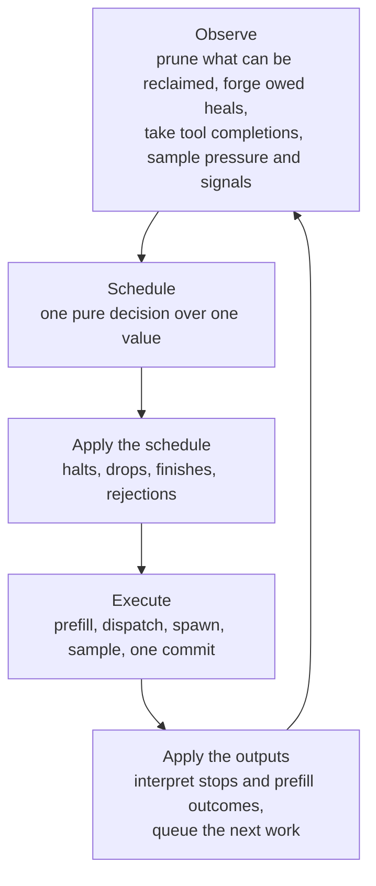
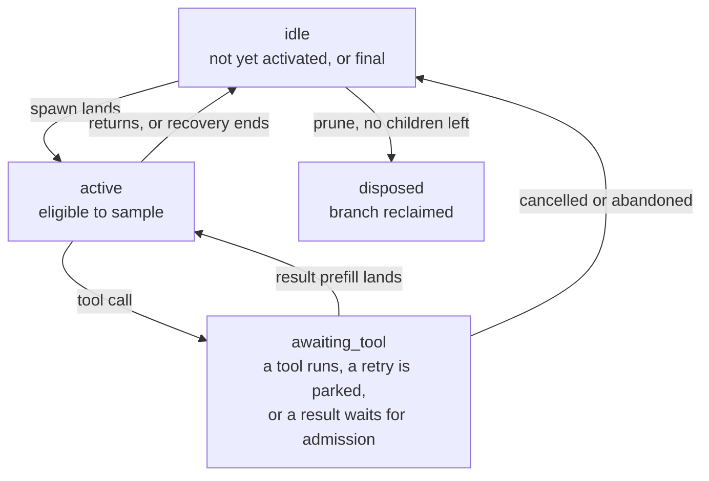

# The agent pool loop

Think of the pool as **one coordinator advancing many agents together**. Every agent has its own branch of the
shared model context and its own progress; the pool decides, once per tick, which work gets the context.

One trip around the loop is a **tick**. A tick can advance many agents. Everything the tick needs to know is read
once, at the top, into a `TickState`; everything it decides is one `Schedule`; the rest of the tick enacts that
schedule and books what came back. That order is the whole design: **decide first, then do, then learn.**

## The five phases, and where each lives

| phase              | file            | what happens                                                                                                                                                                                                                                                                                                                                                                                                                                      |
| ------------------ | --------------- | ------------------------------------------------------------------------------------------------------------------------------------------------------------------------------------------------------------------------------------------------------------------------------------------------------------------------------------------------------------------------------------------------------------------------------------------------- |
| Observe            | `agent-pool.ts` | `prunePass()` reclaims every branch that can be reclaimed, to a fixpoint. Heals the failure ladder decided are forged now, after the prune pass, as ordinary spawn requests. If the pool is paused, only a cancel can run a tick. Fan-out tool completions are taken in. If the last tick ran nothing, the loop waits for a wake or the next due retry. Then one `ContextPressure` sample and one snapshot of the signals become the `TickState`. |
| Schedule           | `scheduler.ts`  | `schedule(state, policy)` returns a `Schedule`. It performs no native call. Its steps run in a fixed order: cancels; admission through one FIFO ledger for spawns and items; produce-phase verdicts per agent; retries; the stall-break; close.                                                                                                                                                                                                   |
| Apply the schedule | `apply.ts`      | `applySchedule(S)` enacts what needs no decode: drops with the recovery each drop decided, finishes, rejected spawns and extends.                                                                                                                                                                                                                                                                                                                 |
| Execute            | `execute.ts`    | `run(S)` in a fixed order: halts of cancelled agents' in-flight tools; admitted prefills, token rail and media rail; tool dispatch, inline on this fiber or fan-out on a child task; spawns and extends as one batched prefill; sampling for the decode set; **one batched commit** for every produced token.                                                                                                                                     |
| Apply the outputs  | `apply.ts`      | `applyOutputs(out, S)` reads the `Outputs`: the token rail's outcome, each media entry's outcome, each stopped agent's parsed output, and a fatal decode if one happened. Tool calls become dispatch requests, returns become results, failures climb the ladder.                                                                                                                                                                                 |

`emit.ts` sits beside these: every state change is a `Transition`, and `project()` turns a transition into the
trace and consumer events. The wire is a projection of what happened, never a second source of truth.

## The Schedule

A `Schedule` is a description of work, not work. Its fields, in the code's own words:

| field                        | meaning                                                                                    |
| ---------------------------- | ------------------------------------------------------------------------------------------ |
| `hold`                       | paused: only cancels' halts run; nothing decodes                                           |
| `halts`                      | agents whose in-flight fan-out tool is halted                                              |
| `drops`                      | schedule-time drops, in decision order, each carrying its recovery decision                |
| `finishes`                   | extracting agents whose report hit its token-stop: finish without sampling                 |
| `spawns`, `rejectedSpawns`   | spawn requests admitted by fit, and those refused                                          |
| `extends`, `rejectedExtends` | spine extends admitted against headroom, landing as one pair; and those that can never fit |
| `prefills`                   | admitted items, in admission order                                                         |
| `stall`                      | stall-break outcomes for items that could not be admitted                                  |
| `abandoned`                  | wind-down: parked retries settled as an honest failure                                     |
| `dispatch`                   | tool calls to run this tick                                                                |
| `decode`                     | agents that sample this tick: active now and not dropped                                   |
| `pressure`                   | the post-admission pressure, what produce-phase and dispatch decisions read                |
| `alive`                      | agents that could still need recovery this tick, the divisor of the cohort budget          |
| `remaining`                  | what is still waiting after this tick's admissions                                         |
| `mode`                       | the recovery mode this tick decided under; wind-down forces `cohort`                       |
| `roster`, `close`            | the agents the decisions were made over; and whether the pool closes after this tick       |

Pressure is sampled once. Admission spends against a ledger, and the post-admission value, `pressure`, is derived
by arithmetic, never by reading the store again mid-decision. That is why decisions inside a tick are
order-independent.

## What an agent is over time

`AgentStatus` is exactly `idle | active | awaiting_tool | disposed`. Two things ride beside it and are not statuses:

- `extracting` is a one-way latch: the agent is writing its report under a token budget. An extracting agent
  finishes when its budget is spent or when pressure turns critical, whichever comes first.
- `final` is an operation that resolves the first time the agent is final: `idle` after it lived, or `disposed`.
  Waiting on an agent means `yield* agent.final`. It resolves only once recovery has finished or been declined.

**Finished is not freed.** An idle agent's branch may still supply the prefix its children fork from, or be kept on
purpose for later forks. Logical completion, outstanding native work and physical reclamation are three separate
moments, and the prune pass is the only thing that moves the third.

## Where work waits

Between ticks, work lives in one record, `Pending`: `items` (prefills awaiting admission, tool results among them),
`retries` (parked tool retries with a due time), `dispatches` (tool calls not yet run), `spawns` and `extends`
(requests whose callers are suspended until admission). Two rules hold over it: every entry belongs to an agent
that is still awaiting it, and every prefill a request will cause is counted in its admitted cost before anything
touches the store.

## Recovery and the ladder

A drop decides its recovery at the drop. There is no later sweep: an idle agent is final. Recovery is another turn
on the same agent: a recovery prompt is queued, admitted like any item, and generated through the ordinary loop.
`serial` recovery runs one at a time; `cohort` recovery shares a token budget across everyone still alive, and
wind-down forces it.

A prefill that fails climbs the ladder by return code. A whole failure with `rc` 1 is deferred, up to three times.
A partial failure is a real failure: the branch is poisoned and the agent fails settled. Anything else counts toward
the backend tripwire. On the media rail, an invalid image is told back to the agent as text rather than failed. When
a poisoned agent has a replayable lineage, the ladder marks `heal` on it; the next observe forges the replacement as
a spawn, admitted or refused by fit like any other. Nobody waits for a heal.

## Tools

An **inline** tool runs on the coordinator's own operation, which is what a tool that needs the model context
requires. A **fan-out** tool runs in an Effection child task; its completion lands in a mailbox and wakes the loop,
which takes it in at the next observe. Cancelling an agent halts its fan-out task; the halt is the first thing the
executor does.

## Invariants, and the test that holds each

| invariant                                                                   | held by                                                         |
| --------------------------------------------------------------------------- | --------------------------------------------------------------- |
| a dropped agent gets nothing else from that schedule                        | `agent-cancel-with-queued-work`                                 |
| every fork the pool creates, the pool prunes                                | `spawn-batch-halt.test.ts`, `prune-pass-completes-before-close` |
| every prefill a request will cause is in its admitted cost                  | `heal-admitted-by-fit`, `extend-waits-for-headroom`             |
| queued work belongs to an agent still awaiting it                           | `discarded-agent-not-resurrected`                               |
| every drop decides its recovery at the drop                                 | `agent-cancel-no-sweep-recovery`                                |
| the prune pass is complete when it returns                                  | `prune-pass-reclaims-unpinned-parent`                           |
| the stall-break counts actionable progress only                             | `pressure-exit-via-stall-break`, `scheduler.test.ts`            |
| an extracting agent finishes at its budget or at critical                   | `recovery-never-stops-finishes-at-critical`                     |
| no bare `call()` or `until()` around a decode, no `yield*` inside `finally` | `native-await-invariant.test.ts`, `effection-contract.test.ts`  |

The scenarios live in `test/invariants/scenarios`; each runs the real pool over an instrumented mock store and
checks predicates over the trace.

## Changing it

The scheduler decides; apply and execute enact. A new behaviour is a new lane in the `Schedule` or a new rule in
`schedule()`, not a flag threaded through the executor. Write the scenario first, from the lane-by-path matrix of
who can change what between decision and enactment, and make it fail before the change.

Two qualifications keep the picture honest: the pending records hold live `Agent` references, and a policy's
callbacks may carry state, so the loop separates deciding from doing without being a pure state machine.

**The model to verify against the code:** one shared execution loop; many agent branches; queued work between
turns; logical completion before optional physical reclamation.
